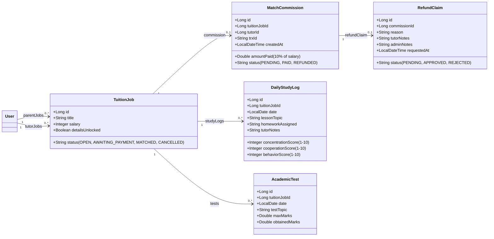
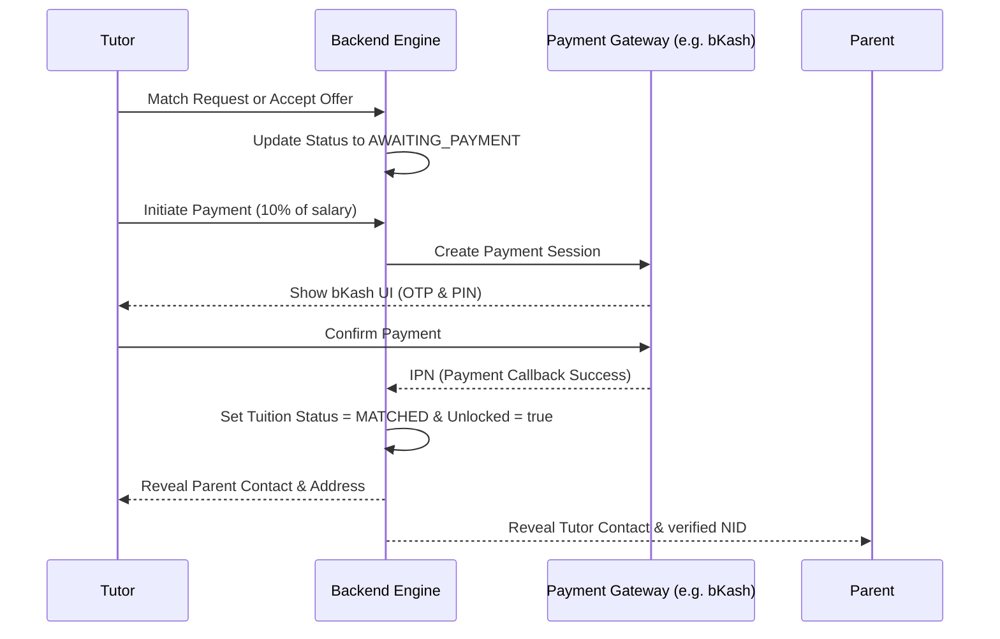

# TutorHire Implementation Plan: Revenue Model & Student Tracking

> [!IMPORTANT]
> **Core Backend Migration Directive (Node.js to Java Spring Boot)**  
> The entire backend system is migrating away from Node.js (Next.js serverless API routes) to a standalone, dedicated **Java Spring Boot** backend application. The Next.js project will focus purely on frontend rendering and user interface interactions. All business logic, security authentication, payment processors, OCR parsers, and database ORM transactions must be implemented inside the Java Spring Boot service. **No existing features, safety controls, or functionalities must be compromised or lost during this migration.**

This document outlines the detailed system architecture, database changes, API designs, and UI specifications required to implement the **10% Tutor Commission matching system**, **Admin Refund workflow**, and the **Student Study & Performance Tracking portal** inside our unified Java Spring Boot backend and Next.js frontend ecosystem.

---

## 1. Database Schema Specifications (Java Spring Boot JPA Entities)

To support transactional unlocking, claims verification, and academic tracking, we will declare the following PostgreSQL tables mapped to JPA entities:



### A. Commission & Refund Models
```java
@Entity
@Table(name = "match_commissions")
public class MatchCommission {
    @Id
    @GeneratedValue(strategy = GenerationType.IDENTITY)
    private Long id;

    @OneToOne
    @JoinColumn(name = "job_id", nullable = false)
    private TuitionJob job;

    @ManyToOne
    @JoinColumn(name = "tutor_id", nullable = false)
    private User tutor;

    private Double amountPaid; // 10% of job.salary
    private String transactionId;
    
    @Enumerated(EnumType.STRING)
    private PaymentStatus status; // PENDING, PAID, REFUNDED

    private LocalDateTime createdAt = LocalDateTime.now();
}

@Entity
@Table(name = "refund_claims")
public class RefundClaim {
    @Id
    @GeneratedValue(strategy = GenerationType.IDENTITY)
    private Long id;

    @OneToOne
    @JoinColumn(name = "commission_id", nullable = false)
    private MatchCommission commission;

    @Column(columnDefinition = "TEXT", nullable = false)
    private String reason;

    private String status = "PENDING"; // PENDING, APPROVED, REJECTED
    
    @Column(columnDefinition = "TEXT")
    private String adminVerificationNotes;

    private LocalDateTime requestedAt = LocalDateTime.now();
    private LocalDateTime reviewedAt;
}
```

### B. Student Study Tracking Models
```java
@Entity
@Table(name = "daily_study_logs")
public class DailyStudyLog {
    @Id
    @GeneratedValue(strategy = GenerationType.IDENTITY)
    private Long id;

    @ManyToOne
    @JoinColumn(name = "job_id", nullable = false)
    private TuitionJob job;

    private LocalDate logDate;
    private String lessonTopic;
    private String homeworkAssigned;

    // Student Evaluation Scores (Scale: 1-10)
    private Integer concentrationScore;
    private Integer cooperationScore;
    private Integer behaviorScore;

    @Column(columnDefinition = "TEXT")
    private String tutorNotes;
}

@Entity
@Table(name = "academic_tests")
public class AcademicTest {
    @Id
    @GeneratedValue(strategy = GenerationType.IDENTITY)
    private Long id;

    @ManyToOne
    @JoinColumn(name = "job_id", nullable = false)
    private TuitionJob job;

    private LocalDate testDate;
    private String testTopic;
    private Double maxMarks;
    private Double obtainedMarks;
}
```

---

## 2. Match & Commission Payment Workflow (Backend APIs)



### Required REST API Endpoints

1. **`POST /api/match/request`**
   * **Payload:** `{ jobId: Long, role: String }`
   * **Behavior:** Locks base credentials and calculates 10% commission payload. Transition job status to `AWAITING_PAYMENT`.
2. **`POST /api/match/payment/initiate`**
   * **Payload:** `{ jobId: Long }`
   * **Response:** Redirect URL to payment gateway (bKash/SSLCommerz).
3. **`POST /api/match/payment/callback` (Webhook)**
   * **Payload:** SSLCommerz IPN / bKash callback data.
   * **Behavior:** Verifies transaction signature, marks `MatchCommission` as `PAID`, sets `TuitionJob.detailsUnlocked = true`.
4. **`POST /api/match/refund/claim`**
   * **Payload:** `{ commissionId: Long, reason: String, attachmentUrl: String }`
   * **Validation:** Verifies if request is submitted within 24 hours of cancellation. Saves `RefundClaim` with status `PENDING`.
5. **`GET /api/admin/refunds` (Admin Role)**
   * **Behavior:** Returns list of pending refunds.
6. **`POST /api/admin/refunds/{id}/resolve` (Admin Role)**
   * **Payload:** `{ action: "APPROVE"|"REJECT", adminNotes: String }`
   * **Behavior:** Triggers manual payment gateway payout API, updates claim status, notifies tutor.

---

## 3. Student Study & Performance Tracking System

### A. Daily Lesson Entry API (For Tutors)
* **`POST /api/tracking/logs`**
  * **Payload:**
    ```json
    {
      "jobId": 12,
      "date": "2026-08-07",
      "lessonTopic": "Newtonian Mechanics (Chapter 4)",
      "homeworkAssigned": "Solve exercises 4.1 to 4.15",
      "concentrationScore": 8,
      "cooperationScore": 9,
      "behaviorScore": 9,
      "tutorNotes": "Student was responsive but struggled with friction problems. Needs review."
    }
    ```

### B. Test Record Entry API (For Tutors)
* **`POST /api/tracking/tests`**
  * **Payload:**
    ```json
    {
      "jobId": 12,
      "date": "2026-08-07",
      "testTopic": "Linear Algebra Quiz 1",
      "maxMarks": 20,
      "obtainedMarks": 17.5
    }
    ```

### C. Analytics Dashboard API (For Parents)
* **`GET /api/tracking/analytics?jobId={jobId}&period=monthly`**
  * **Response:** Returns aggregated average scores for concentration, cooperation, and behavior over time along with list of tests and score percentages.

---

## 4. Frontend Component Layouts (Next.js & TailwindCSS)

### A. Tutor Matching & Payment Screen
```typescript
// Proposed component logic for match confirmation page
export default function MatchUnlock({ jobId, salary }) {
  const fee = salary * 0.10;
  return (
    <div className="p-6 max-w-md mx-auto bg-white rounded-xl shadow-md border border-gray-100">
      <h2 className="text-xl font-semibold mb-2">Unlock Guardian Contact</h2>
      <p className="text-sm text-gray-500 mb-4">
        To request or finalize matching, you must pay a one-time 10% commission fee of <strong>{fee} BDT</strong>. 
        Your funds are safe under our 24-Hour refund security guarantee.
      </p>
      <button className="w-full py-3 bg-emerald-500 text-white rounded-lg font-bold hover:bg-emerald-600 transition">
        Pay {fee} BDT via bKash / Card
      </button>
    </div>
  );
}
```

### B. Tutor Refund Claim Form Screen (Tutor Portal)
A component designed for tutors to claim their refund when a tuition fails to finalize:

```typescript
// Proposed component for Tutor Refund Request Form
export default function RefundClaimForm({ commissionId, tuitionJobTitle, feePaid }) {
  return (
    <div className="p-6 max-w-lg mx-auto bg-white rounded-xl shadow-md border border-gray-100 mt-6">
      <h2 className="text-xl font-bold text-gray-800 mb-2">Request 100% Refund</h2>
      <p className="text-sm text-gray-500 mb-4">
        Job: <strong>{tuitionJobTitle}</strong> | Fee Paid: <strong>{feePaid} BDT</strong>
      </p>
      
      <form className="space-y-4">
        <div>
          <label className="block text-sm font-semibold text-gray-700 mb-1">Reason for Refund Request</label>
          <select className="w-full p-2.5 border rounded-lg bg-gray-50 focus:ring-2 focus:ring-emerald-500">
            <option>Guardian cancelled/hired someone else</option>
            <option>Schedule/timing mismatch discovered during call</option>
            <option>Location details incorrect or too far</option>
            <option>Salary/requirements differed from description</option>
            <option>Other (Specify below)</option>
          </select>
        </div>

        <div>
          <label className="block text-sm font-semibold text-gray-700 mb-1">Detailed Explanation</label>
          <textarea 
            rows={4} 
            placeholder="Please detail exactly what occurred after unlocking..." 
            className="w-full p-2.5 border rounded-lg focus:ring-2 focus:ring-emerald-500"
            required
          />
        </div>

        <div>
          <label className="block text-sm font-semibold text-gray-700 mb-1">Supporting Documentation (Screenshots, Chat Logs)</label>
          <input 
            type="file" 
            accept="image/*,.pdf" 
            className="w-full text-sm text-gray-500 file:mr-4 file:py-2 file:px-4 file:rounded-md file:border-0 file:text-sm file:font-semibold file:bg-gray-100 file:text-gray-700 hover:file:bg-gray-200"
          />
          <p className="text-xs text-gray-400 mt-1">Upload screenshots of SMS/call history or WhatsApp chats supporting your claim.</p>
        </div>

        <button type="submit" className="w-full py-3 bg-red-500 text-white rounded-lg font-bold hover:bg-red-600 transition">
          Submit Refund Claim
        </button>
      </form>
    </div>
  );
}
```

### C. Daily Log Form (Tutor Portal)
A simple entry form containing inputs for text and slider ratings (1 to 10):
* Slider: **Concentration Level** (Highly unfocused $\rightarrow$ Fully engaged)
* Slider: **Cooperation / Homework Completion** (Did not attempt $\rightarrow$ Completed everything)
* Slider: **Student Behavior / Attitude** (Disruptive $\rightarrow$ Polite & helpful)
* Textarea: **Lesson Notes & Next Day's Plan**

### D. Guardian Performance Charts (Parent Portal)
Utilize `Recharts` to present line graphs tracking progress:
* **Lesson Progress Chart:** Multiple lines tracing Daily Scores (Concentration, Cooperation, Behavior) plotted over the selected time filter (Weekly, Monthly, Yearly).
* **Test Performance Chart:** Bar graph comparing `obtainedMarks / maxMarks` as percentages over time, showcasing academic improvement trends.

---

## 5. Security & Verification Checks (OOP Principles)

1. **Role Access Restriction:** Ensure only the assigned `TUTOR` can post logs to a specific `jobId`. Ensure only the linked `PARENT` can query the tracking analytics.
2. **Payment Verification:** Implement Spring Security filter checking JWT credentials before allowing transaction initialization.
3. **Refund Verification Flow (Strict Admin Review):**
   * **Deadline Check:** The backend validation logic verifies if `RefundClaim.requestedAt` is submitted within 24 hours of matching or the issue discovery.
   * **Document & Chat Audit:** Admin reviews the submitted reason and uploaded attachments (screenshots, chat transcripts) in the Admin Dashboard.
   * **Guardian Verification Contact:** The admin contacts the guardian directly via phone/email to confirm the tuition did not start or failed.
   * **Payout Execution:** Upon positive verification, the system executes an automated refund payload via SSLCommerz/bKash API to return 100% of the commission fee back to the tutor's wallet. If rejected, a detailed status response is saved to the claim.

